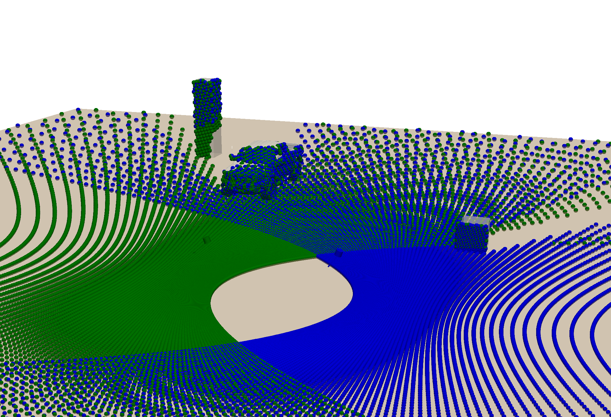

# LIDAR ft. pyvista

A simple plotter for LIDAR point cloud.



```
INFO, main, Starting 'case_0.500_0.500'
INFO, get_points, Get points for lidar lidar_1
DEBUG, intersect, Intersecting obj floor
DEBUG, intersect, Intersecting obj cube_1
DEBUG, intersect, Intersecting obj cube_2
DEBUG, intersect, Intersecting obj raptor
DEBUG, compute_frame, 26816 points found for lidar_1 in 28.51s
INFO, get_points, Get points for lidar lidar_2
DEBUG, intersect, Intersecting obj floor
DEBUG, intersect, Intersecting obj cube_1
DEBUG, intersect, Intersecting obj cube_2
DEBUG, intersect, Intersecting obj raptor
DEBUG, compute_frame, 26688 points found for lidar_2 in 29.52s
DEBUG, compute_frame, Starting to plot intersection points
DEBUG, compute_frame, Finished to plot intersection points
INFO, render, Loading visualisation...
INFO, render, Loaded visualisation in 1.51s
INFO, main, Finished 'case_0.500_0.500' in 60.34s
```
